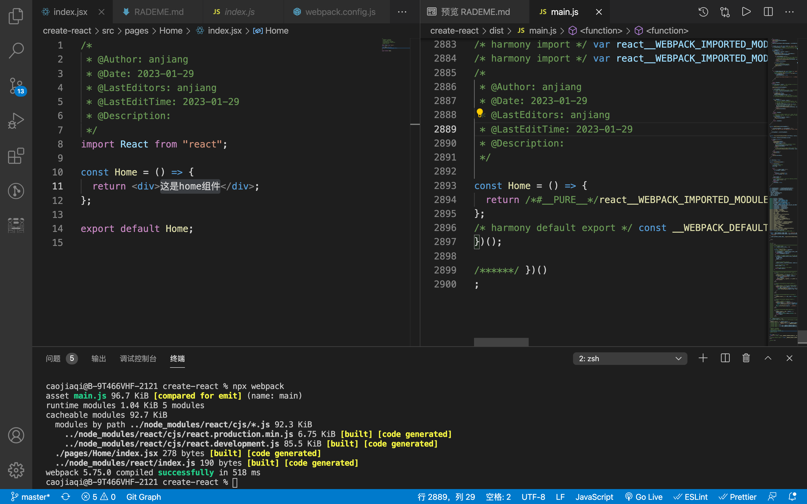
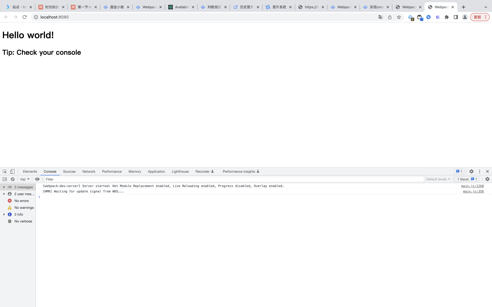

# 本项目用来学习搭建 react 环境

## 使用 Babel 加载 JSX 文件


### 一、初始化项目

```
npm init -y
```

添加.gitignore 文件

```
/node_modules
```

---

### 二、配置 **_babel-loader_** ，并使用 React 预设规则集 @bebel/preset-react

目的是完成 JSX 到 JavaScript 的转换

#### 1.安装依赖

```
npm i -D webpack webpack-cli babel-loader @babel/core @babel/preset-react
```

#### 2.添加**webpack.config.js**文件并修改 Webpack 配置，加入 **_babel-loader_**相关声明

```
module.exports = {
	context: path.join(__dirname, 'src'),
	entry: path.resolve(__dirname, "./src/index.jsx"),
	output: {
		filename: "[name].js",
		path: path.join(__dirname, "./dist"),
	},
  mode: 'none',
  module: {
    rules: [
      {
        test: /\.jsx$/,
        loader: "babel-loader",
        options: {
          presets: ["@babel/preset-react"],
        }
      },
    ],
  },
};
```

注意：这里 entry 尽量使用绝对路径，否则可能会报错

#### 3.安装 react、react-dom 并创建一个 index.jsx 文件

```
npm i react react-dom
```

`src/index.jsx`

```
import React from "react";

const Home = () => {
	return <div>hello home</div>;
};

export default Home;

```

#### 4.执行构建命令， <font color="#ff502c">npx webpack</font>

经过 babel-loader 处理后，JSX 将被编译为 JavaScript 格式的 React.createElement 函数调用，如：


此外，JSX 支持新旧两种转换模式，一是上图这种 React.createElement 函数，这种模式要求我们在代码中引入 React，如上图的 `import React from "react"；`二是自动帮我们注入运行时代码，此时需要设置 `runtime:automatic`，如：

```
{
  test: /\.jsx$/,
  loader: 'babel-loader',
  options: {
    "presets": [
      ["@babel/preset-react", {
        "runtime": "automatic"
      }]
    ]
  }
}
```

两种模式打包出内容的对比：

`不使用runtime：`

```
const Home = () => {
  return /*#__PURE__*/react__WEBPACK_IMPORTED_MODULE_0___default().createElement("div", null, "\u8FD9\u662Fhome\u7EC4\u4EF6");
};
```

`使用runtime：`

```
const Home = () => {
  return /*#__PURE__*/(0,react_jsx_runtime__WEBPACK_IMPORTED_MODULE_1__.jsx)("div", {
    children: "\u8FD9\u662Fhome\u7EC4\u4EF6"
  });
};
```

这种模式会自动导入 react/jsx-runtime，不必开发者手动管理 React 依赖。

---

### 三、安装并配置处理 css 的 loader

注意，上例 Webpack 配置还无法处理 CSS 代码，为此需要添加 CSS 加载器

```
npm i style-loader css-loader
```

```
  {
    test: /\.css$/,
    use: ["style-loader", "css-loader"],
  }
```

使用less预处理语言

```
npm i less less-loader
```

```
{
  test: /\.less$/,
  use: ["style-loader", "css-loader", "less-loader"],
}
```

## 运行页面
上例接入的 babel-loader 使得 Webpack 能够正确理解、翻译 JSX 文件的内容，接下来我们还需要用 html-webpack-plugin 和 webpack-dev-server 让页面真正运行起来，配置如下：


### 一、在根目录下创建index.html文件

```
<!DOCTYPE html>
<html>
	<head>
		<meta charset="utf-8" />
		<title>Webpack App</title>
	</head>
	<body>
		<h1>Hello world!</h1>
		<h2>Tip: Check your console</h2>
	</body>
</html>

```

### 二、安装webpack-dev-server 、html-webpack-plugin

```
npm i webpack-dev-server html-webpack-plugin
```

### 三、配置webpack

```
/*
 * @Author: anjiang
 * @Date: 2023-01-29
 * @LastEditors: anjiang
 * @LastEditTime: 2023-01-29
 * @Description:
 */
const path = require("path");
const HtmlWebpackPlugin = require("html-webpack-plugin");
const webpack = require("webpack");

module.exports = {
  ...
	devServer: {
		hot: true,
		open: true,
	},
	plugins: [
		new HtmlWebpackPlugin({
			template: "index.html",
		}),
		// 此处用来解决process is not define的问题
		new webpack.DefinePlugin({
			"process.env.NODE_ENV": JSON.stringify(process.env.NODE_ENV),
			"process.env.MY_ENV": JSON.stringify(process.env.MY_ENV),
		}),
	]
};

```

### 四、运行 npx webpack serve 命令，即可自动打开带热更功能的页面

```
npx webpack serve
```



---

## 复用其它编译工具

`使用 TSX`
`使用 @babel/preset-typescript`

社区有两种主流的 TSX 加载方案，一是使用 Babel 的 @babel/preset-typescript 规则集；二是直接使用 ts-loader。先从 Babel 规则集方案说起：

### 一、安装typescript @babel/preset-typescript

```
npm i -D typescript @babel/preset-typescript
```

### 二、修改 Webpack 配置，添加用于处理 TypeScript 代码的规则

```
module.exports = {
  module: {
    rules: [
      {
        test: /\.tsx$/,
        loader: 'babel-loader',
        options: {
          'presets': [["@babel/preset-react", {
            "runtime": "automatic"
          }],
          '@babel/preset-typescript']
        }
      },
    ],
  },
}
```

### 三、测试，修改文件为tsx，执行`npx webpack`

`使用ts-loader`

#### 一、安装依赖

```
npm i -D typescript ts-loader
```

#### 二、修改 Webpack 配置，添加 ts-loader 规则

```
module.exports = {
  resolve: {
    extensions: ['.js', '.jsx', '.ts', '.tsx'],
  },
  module: {
    rules: [
      {
        test: /\.tsx$/,
        use: 'ts-loader',
      },
    ],
  }
};
```

#### 三、修改 tsconfig.json 文件，添加 jsx 配置属性

```
{
  "compilerOptions": {
    //...
    "jsx": "react-jsx"
  }
}
```